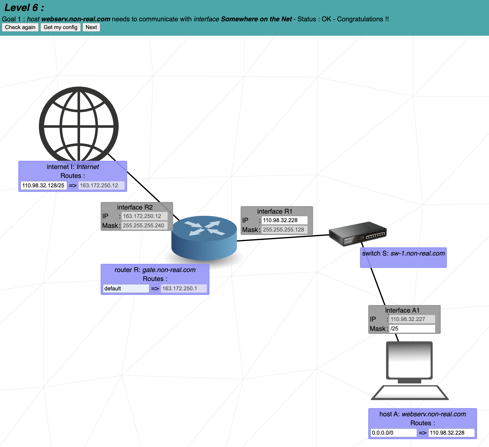
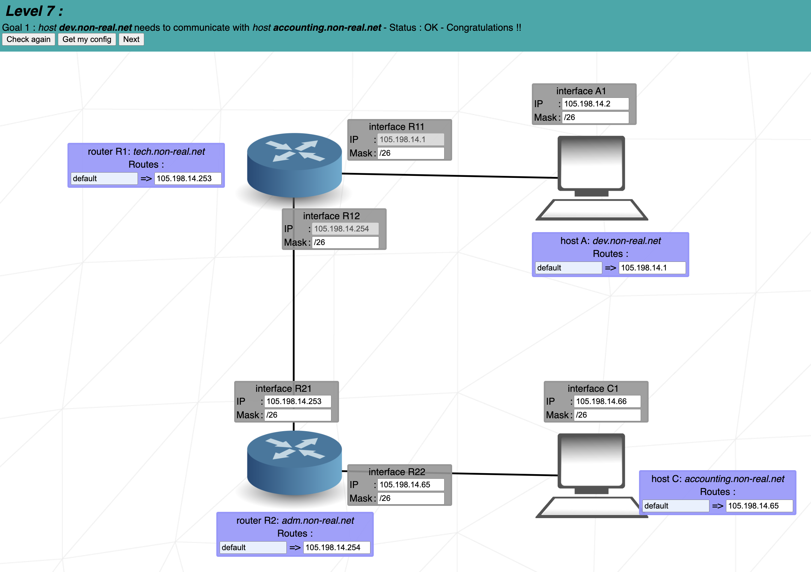
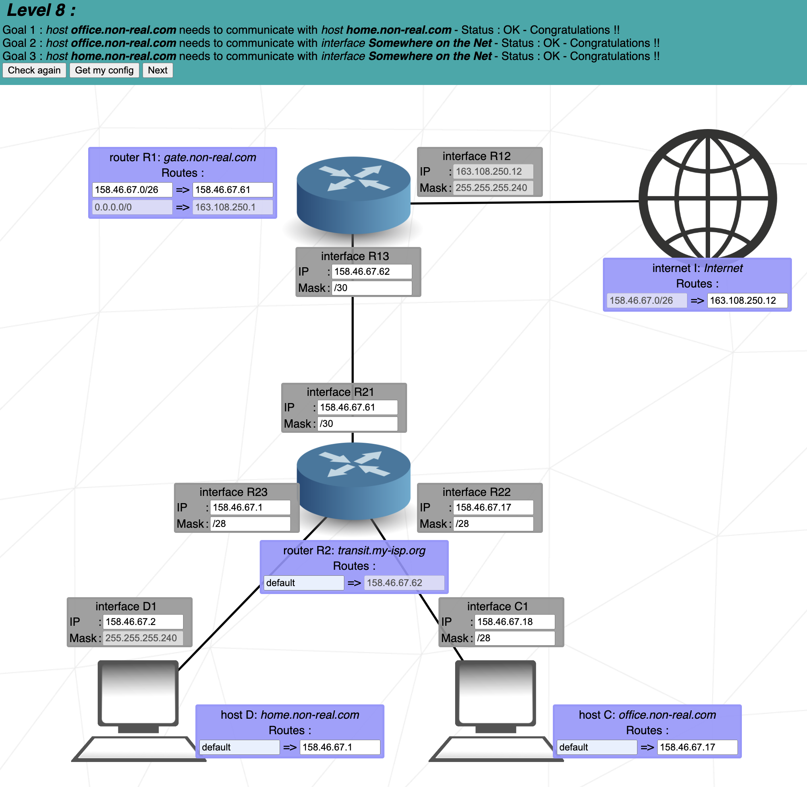
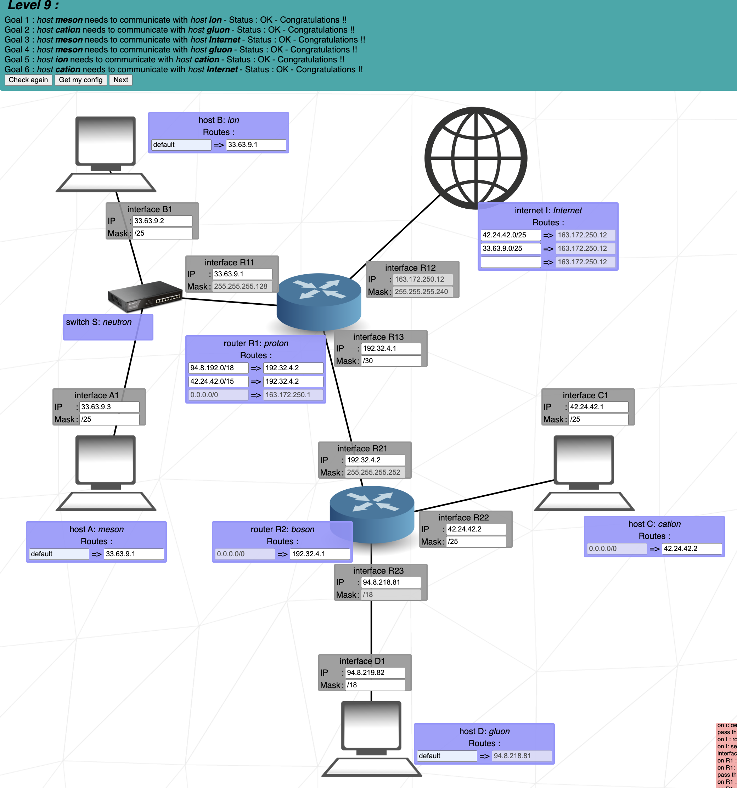
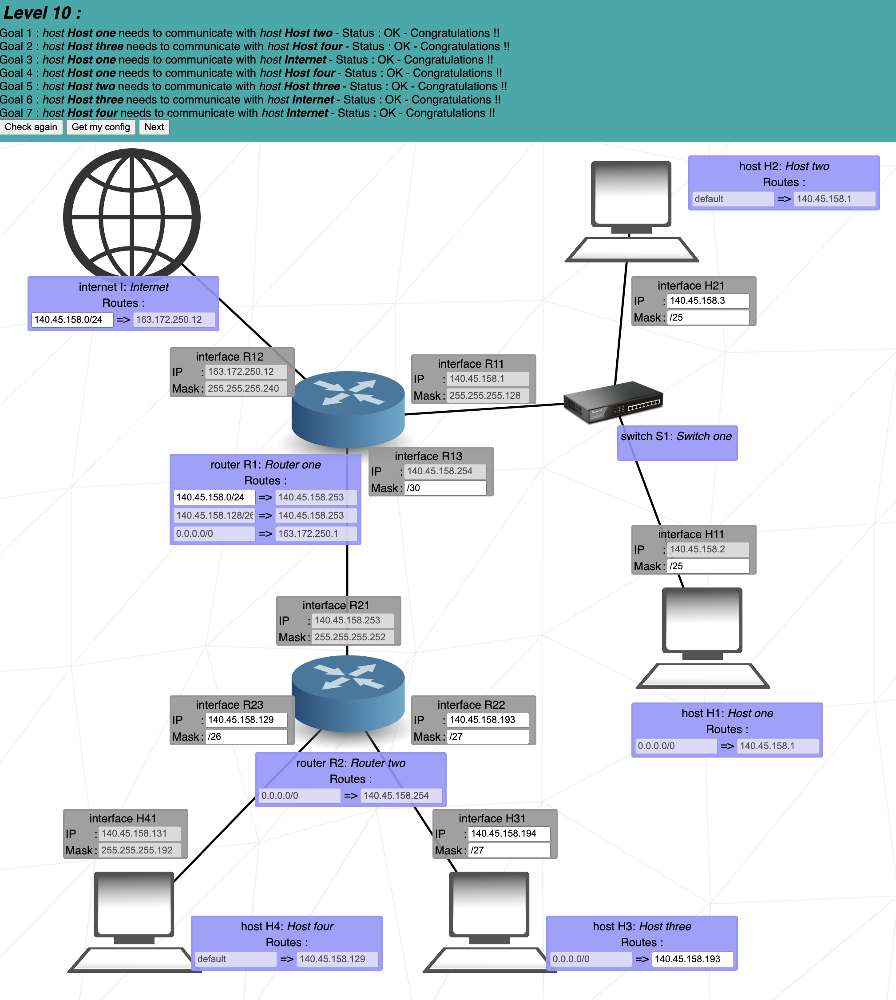

# Net_Practice

  

Bienvenidos a Net_Practice, un ejercicio destinado a dominar la configuración y resolución de problemas de redes. Este README te guiará a través de los conceptos esenciales requeridos para navegar y tener éxito en este proyecto.

<strong>Concepts</strong>

  
### 1. TCP/IP
**IP (Internet Protocol Adresses):** Una cadena única de números separados por puntos (IPv4) o dos puntos (IPv6) que identifica un dispositivo en una red. Una dirección IP consta de dos partes principales: el ID de Red y el ID de Host, diferenciados por una máscara de subred. Por ejemplo, en la dirección IP `192.168.1.1/24`, el ID de Red es `192.168.1` y el ID de Host es `1` .

#### Subcomponentes:
- **Subnet Mask:** Una combinación de bits que enmascara la dirección IP y divide los componentes de red y host.
- **Network Id:**  La parte de la dirección IP que identifica la red específica.
- **Host Id:** La parte de la dirección IP que identifica el dispositivo específico en la red.

### 2. IPv4 vs IPv6

La transición de IPv4 a IPv6 ha introducido cambios significativos en la tecnología del protocolo de internet. A continuación se muestra una tabla comparativa que destaca las diferencias clave entre estas dos versiones:

| Característica         | IPv4                                       | IPv6                                                  |
|------------------------|--------------------------------------------|-------------------------------------------------------|
| **Año de Despliegue**  | 1981                                       | 1998                                                  |
| **Capacidad de Bits**  | 32 bits                                    | 128 bits                                              |
| **Número de Direcciones**| ~4.3 mil millones                         | ~340 undecillones (3.4 × 10^38)                        |
| **Notación de Direcciones**   | Decimal separado por puntos (ej. 192.108.42.64)       | Hexadecimal separado por dos puntos (ej. 2002:0de6:0001:0042:0100:8c2e:0370:7234) |
| **Configuración**      | Configuración manual o DHCP                | Soporta auto-configuración y más opciones automáticas |
| **Uso de Direcciones** | Reutilización de direcciones por limitación de espacio | Cada dispositivo puede tener su propia dirección única |

### 3. Dispositivos

- **Switch:** Conecta dispositivos dentro del mismo segmento de red, reduciendo colisiones de tráfico de datos y gestionando efectivamente el flujo de datos a través de direcciones MAC (Control Media Access).
- **Router:** Enlaza múltiples redes o subredes, ya sean LAN (Red de Área Local) o WAN (Wide Area Network). Asegura la ruta óptima del tráfico, asigna IPs locales y realiza la traducción de direcciones mediante NAT (Network Address Translation). Componentes clave en su tabla de enrutamiento incluyen:
  - **Next Hop:** Indica la dirección IP del próximo router donde se enviarán los paquetes de datos.
  - **Destination:** Especifica la red de destino para los paquetes de datos.

- **Módem:** Un dispositivo que modula y demodula señales digitales y analógicas, permitiendo la conexión de una red a internet al traducir datos entre estos dos tipos de señales.

### 4. Subnetting

Subnetting implica dividir una red IP física en múltiples subredes lógicas. Cada subred opera independientemente en el nivel de envío y recepción de paquetes, aunque todas pertenecen a la misma red física y dominio.

### 5. Dirección Loopback

Un rango de dirección IP especial (127.0.0.0 a 127.255.255.255) reservado para comunicaciones internas dentro de un dispositivo. Esto permite que un dispositivo envíe y reciba paquetes hacia y desde sí mismo, lo cual es crucial para pruebas y gestión de redes.
  

<strong>Mask Explanation</strong>

# Mask Explanation

Para comenzar vamos a suponer que la network id abarca los 3 primeros octetos y solo vamos a interactuar con el último que va desde  ``192.168.1.0`` a `192.168.1.255`.

Este último octeto son 8 bytes, cada uno de los cuales puede ser `0` o `1`, por lo que si todos están activados(`11111111`) sería `2 ^ 8` = `256`.

Antes hemos comentado que la ip podíamos dividirla en **Network ID**, y **Host Id**, usando la máscara, de esta forma, cuando asignamos una máscara en notación CDIR `\24` estaríamos asignando los 3 primeros bytes (8 * 3 = 24 primeros bits) para la **Network ID**, y unicamente el último octeto de bits para el host, por lo que esta red (192.168.1.0/24) abarcaría desde ``192.168.1.0`` a `192.168.1.255`, abarcando 256 ip's posibles.

Podemos subdividir esta red en en dos redes de igual tamaño aplicando una máscara /25, es decir dejando libres para el host unicamente los 7 ultimos bits, estaríamos convirtiendo la red en dos redes: 

**Primera**. `192.168.1.0/25` que alberga 128 ip's de la `192.168.1.0` a la `192.168.1.128`.

**Segunda**.`192.168.1.128/25` que alberga 128 ip's de la `192.168.1.128` a la `192.168.1.255`.

De igual forma en vez de dividir la red en notación CDIR podemos hacerlo con la subnet mask, es decir `/25` correspondería con `255.255.255.128` que a su vez correspondería con `11111111.11111111.11111111.10000000` porque al ser el primer bit, `2 ^ 7` = `128`. Esto quiere decir que cada segmento de red con esta máscara abarca 128 posibles ip`s. 

Esto puede parecer un poco complejo, por eso te voy a presentar un cheat Sheat que te permitirá convertir de CDIR a Subnet Mask en 60 segundos.

<strong>Cheat Sheet</strong>

# Cheat Sheet

  Group Size  | 128 | 64 | 32 | 16 | 8 | 4 | 2 | 1 |
|-------------|-----|----|----|----|---|---|---|---|
| Subnet Mask | 128 | 192| 224| 240| 248| 252| 254| 255 |
| CIDR        | /25 | /26| /27| /28| /29| /30| /31| /32 |

Crear esta tabla es realmente sencillo, especialmente si sigues estos pasos:

  **1.** La primera fila son 8 potencias de 2, desde `2 ^ 7`hasta `2 ^ 0`.
  
  **2.** La segunda fila la obtendrás de restar a 256 (ip's posibles), el **Group Size**.
  
  **3.** Por ultimo comenzando desde la izquierda, desde `/25` porque estás cogiendo el primer bit del 4 octeto hasta el total de bits que caben en 4 bytes.

<strong>How to solve</strong>

# How to solve

Primero abordemos una serie de conceptos :
  # Concepts:
  
   - **Network id**: La parte de la dirección IP que identifica la red específica.
   - **First id**: Primera ip util, la obtenemos sumando uno a la **Network id**
   - **Last id**:  última ip util, la obtenemos restando uno a la **Broadcast id**
   - **Broadcast id**: Dirección de red utilizada para transmitir a todos los dispositivos conectados a una red de comunicaciones de acceso múltiple.

Ahora que sabes crear tu propio **Cheat Sheet**, y conoces los conceptos necesarios, no hay escusas, podrás resolver cualquier problema de **Subnetting** en menos de 60 segundos siguiendo estos pasos:

# Steeps
Supongamos que queremos saber a que red pertenece la ip: ``10.2.2.199/26``

  **Steep 1.** 
    
  Miramos en la tabla el `/26` y observamos que como **Subnet Mask** se representaría con 255.255.255.`192`, esto proviene de `11000000`, es decir `2 ^ 7` = `128` + `2 ^ 6` = `64` = `192`, osea disponemos de 6 bits para el host, lo que divide la red en 4 subredes que cubren 64 ips cada una. 

  Podemos hacer lo siguiente:     
  
                                      10.2.2.0 
                                      10.2.2.64 
                                      10.2.2.128  
            **Network id**  ----->    10.2.2.192
                                            `10.2.2.193`     <------  **First id**
                                            `10.2.2.253`     <------  **Last id**
                                            `10.2.2.254`     <------  **Broadcast id**
            **Next id**  -------->    10.2.2.255

Dividimos el octeto .255 en 4 secciones de 64 ips, y vemos entre que segmento se encuentra nuestra ip `10.2.2.199/26`, en este caso vemos que se encuentra en el cuarto segmento, entre `10.2.2.192` y `10.2.2.254`, por lo que este primero será **Network id** y el segundo **Broadcast id**, dejando `64 - 2` = `62` direcciones dispoibles, desde la **First id** hasta la **Last id**.

Ahora que ya sabes resolver esto, puede resultarte incluso sencillo, pero puede resultar un proceso más lento cuando la red se divide en más subredes, por ejemplo si fuese un CDIR `/29`, Y tuviesemos que contar desde `10.2.2.0` hasta `10.2.2.192` de 8 en 8.

Por eso te voy a facilitar los siguientes **Speed Tricks**.

# Speed Tricks:

Para simplificar el proceso a la hora de buscar a que subred pertenece una ip, sobretodo cuando el **group size** es pequeño puedes utilizar estos trucos:

    1. Multiplicar el **Group size** por **10**   EX: 8 * 10 = 80;    --->   .8
                                                                      --->  .80
                                                                      --->  .160  
    
    2. Multiplicar el Multiplicar el **Group size** por **2**         --->  .8
                                                                      --->  .80
                                                                                 x2
                                                                      --->  .160
                                                                      
    3. Todos los grupos pasan por 128, asique podemos partir de este número para iniciar la búsqueda.
    
    4. Todos los grupos pasan por el subnet Mask de su izquierda en la cheat sheet, asique es un buen momento 
    para hacer uso de esta, y en caso de pasarnos, empezar por un ip superior y restar el group size hasta encontrar el
    segmento al que pertenece nuestro ip objetivo.

<strong>Levels</strong>

- 

  
<strong>Level 6</strong>

   El nivel 6 presenta dos redes conectadas por un router, la primera parte de `internet` y la segunda pasando por un switch desemboca en `Host A`.
  Nos condicionan que en esta segunda red usaremos una máscara `255.255.255.128` es decir `/25` y la interfaz del host en `110.98.32.227`, por lo que estamos diviendo la red `110.98.32.0/24` en dos grupos de 128 y vamos a usar el segundo, por lo que cualquier valor entre `110.98.32.128`(Network Id) y `110.98.32.255`(Broadcast Id), estos no incluidos, nos valdria para la interfaz del router.

  Lo importante en este nivel es que el destino del internet apunte a esta red (`110.98.32.128/25`) para permitir el tráfico.
  
  

  

- 

  
<strong>Level 7</strong>

  En este nivel, se da una conexión entre dos routers, cada uno de los cuales conecta con un host, ambas interfaces de R1 nos condicionan a dividir la red `105.198.14.0/24`, por lo que, para mí, lo más oportuno en este caso es dividirla en `4` subredes de `64` ip's aplicando una máscara `26`, usando la primera subred creada para conectar `A1` y `R1`, la última (entre 192 y 255) para conectar los routers, y la segunda o la tercera para conectar R2 y C1.
  
  En cuanto a la **Routing Table**, es los destinos se pueden dejar por defecto, lo importante es que el **Next Hop** de los routers se apunten entre sí, para intercambiar el tráfico, y ambos host deben apuntar al siguiente router.
   
  

  

- 

  
<strong>Level 8</strong>

  En el nivel 8 tenemos dos routers conectados, el primero conecta con internet, y el segundo conecta a través de dos redes al host D y C.
  
  A mí entre routers me gusta usar una máscara de red `/30`, es decir 4 ips, de las cuales, si excluimos la **Network id** y la **Broadcast id**, nos quedan dos, es decir las necesarias para conectar dos routers, en este caso el **Next Hop** de **R2**, nos proporciona la ip de la interface R13, y para la de R21 podemos usar un valor por debajo.
  
  Por último, intenet solo tiene destino en una red: `158.46.67.0/26` asique haremos subnetting de esta, para conectar ambos host a internet. se nos proporciona una máscara `255.255.255.240`, es decir `/28`, que alberga 16 ips, esto es muy sencillo de comprobar con la **Cheat Sheet** que te proporcioné anteriormente.
  
  Asique para el Host D, podemos usar caulquier valor entre los 16 primeros ips, Network id y Broadcats ip excluidos, y para el Host C del `.17` hasta el `.30` si mantenemos la máscara `/28`, asegurandonos así que no hacemos **overlapping** con el rango que usamos para conectar los routers.

  No te ovlides de establecer el destino en la red de los host `158.46.67.0/26` y el **Next Hop** de internet en la interfaz del siguiente router.
  
   

  

- 

  
<strong>Level 9</strong>

  Este nivel presenta tres redes que deben conectarse a internet, Host A y B, que deben conecarse entre sí, y a R1 a través de un switch, por lo que los albergaremos en una misma red. una red que conecta los routers, R1 y R2, este último conecta dos redes una que concluye en Host D y otra en Host C.

  Será sencillo si dividimos el problema en pequeñas fracciones.

  **step1. Conectar los host C y D**
  - Se nos impone la IP de la interfaz R23, ya que es el **Next Hop** de la **Routing Table** de D1, con una máscara de `/18`, si nos fijamos en el **Cheat Sheet**, nos será fácil descubrir que el **Group size** es de 64 IP's, en el 3º octeto, así que dado que la IP de la interfaz R23 es `94.8.218.81`, sabemos que la **Network id** es: `94.8.192.0/18` y la **Broadcast id** es `94.8.255.255/18` y cualquier valor entre estos nos valdría.
  - Para conectar el Host C, puedes establecer cualquier IP de tu elección, y cualquier máscara de red, nosotros para hacerlo sencillo elegiremos `42.24.42.0/25`, dividiendo la red en dos subredes de '128', y utilizaremos la primera.

  **step2. Conectar los dos Routers**
  - Como venimos practicando, se establece una máscara CDIR `/30`, que contiene 4 IPs de las cuales dos son útiles, para mantenerlo sencillo podríamos elegir cubrir las 4 primeras IPs de cualquier red a tu elección, en este caso elegimos: `192.32.4.0/30`.
  - He aquí la cuestión de este nivel, conectar las **Routing Table**, cada Router **Next Hop** debe apuntar al siguiente router, pero en el destino del primero, debemos apuntar tanto a la red del Host C (Para conectarlo a internet), como a la red del Host D para conectarlo con Host A.

  **step3. Conectar los Host A y B**
  - Tenemos 3 dispositivos, en una misma red, lo único importante es que en ambos Host, el Next Hop apunte a la interfaz de R11, en este caso hemos elegido esta red `33.63.9.0/25`.

  **step4. Routing Table de internet**
  - El Next Hop está configurado a la interfaz del router, bastaría con configurar dos destinos a las redes del Host C, `42.24.42.0/25` y la red que conecta A y B `33.63.9.0/25`, que son lo que no se piden que conecte a internet.  
  
   
  

- 

  
<strong>Level 10</strong>

  Last level!, no te asustes aonque parezca compliado es bastante sencillo, tenemos una red que conecta internet con un router, **R1**, este router conecta con una red que une los dos primeros host con un switch, por otro lado **R1** conecta con un segundo router **R2**, que conecta dos redes que desembocan en **Host 3** y **Host 4**.

  La cuestión es que los host 1, 3 y 4 deben conectar a internet, pero internet, en su **Routing Table** solo tiene un `destino`, asique la logica nos lleva a hacer subnetting de la red en `140.45.158.0/24`, y establecer esta como destino(tanto en internet como en **R1**), así llegando a cualquier host que se albergue en el rango `0-255`.
  dividamos el problema en subproblemas:

  **step1. Conectar los dos primeros host**

   nos condicionan con una máscara `/25` asique asignamos cuaqluier valor entre .0 y .255 ambos incluidos al último octeto.

  **step2. Conexión entre routers**

  nos condicionan con un `255.255.255.252` es decir `/30`es decir 4 ips, de las cuales, si excluimos la **Network id** y la **Broadcast id**, nos quedan dos, es decir las necesarias para conectar dos routers.
  Esto es una buena práctica, no usar más ips de las requeridas.

  **step3. Conectar los dos últimos host**

   Conectar los Host 3 y 4 al Router 2, estamos condicionados por el router 3 a una máscara `255.255.255.192` que en CDIR es `/26`(**Group size** de 64 ip's), fijándonos en las ip´s que nos proporcionan estaríamos ocupando desde `.128` a `.192`.
  por lo tanto para conectar el Host 4, si pusisiesemos también una máscara /26 ocuparíamos desde la `192` hasta `255`, y estaríamos haciendo **overlapping**, es decir se estaría solapando con la red `140.45.158.252/30`que hemos usado previamente como conexión entre routers.
  Para soluccionar esto es tan sencillo como aplicar una máscara `/27`que ocupa 32 ips, y estableciendo estas en un rango entre `140.45.158.192` y `140.45.158.224`.

   
</details                             
