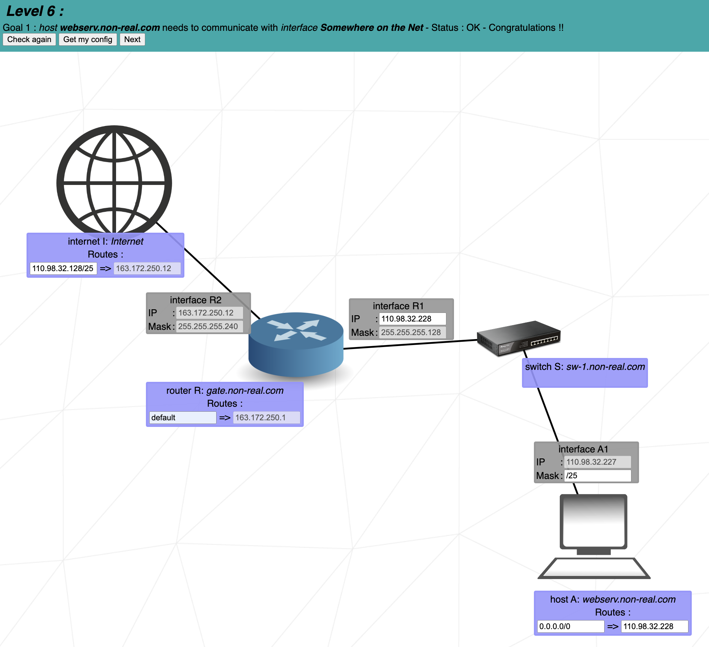
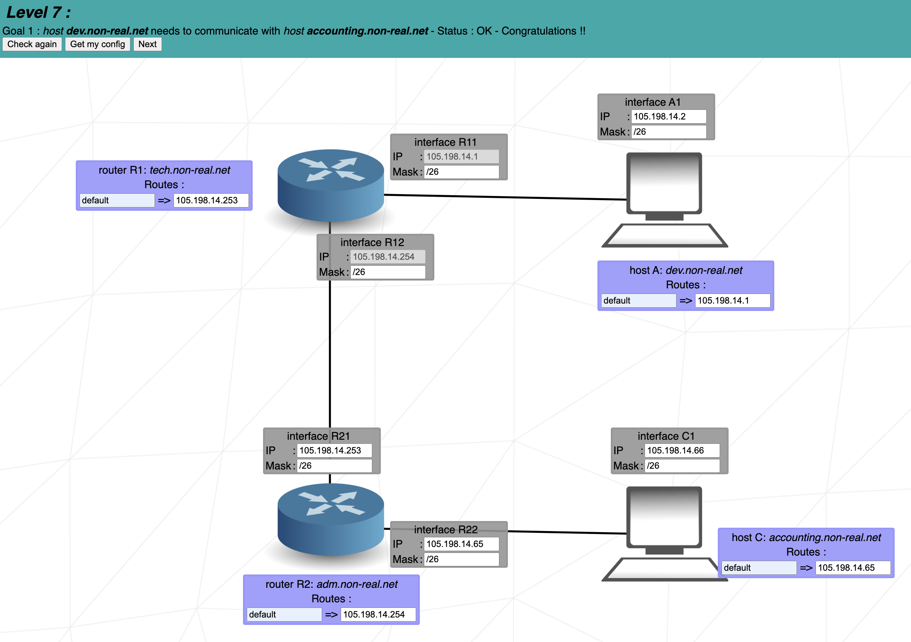
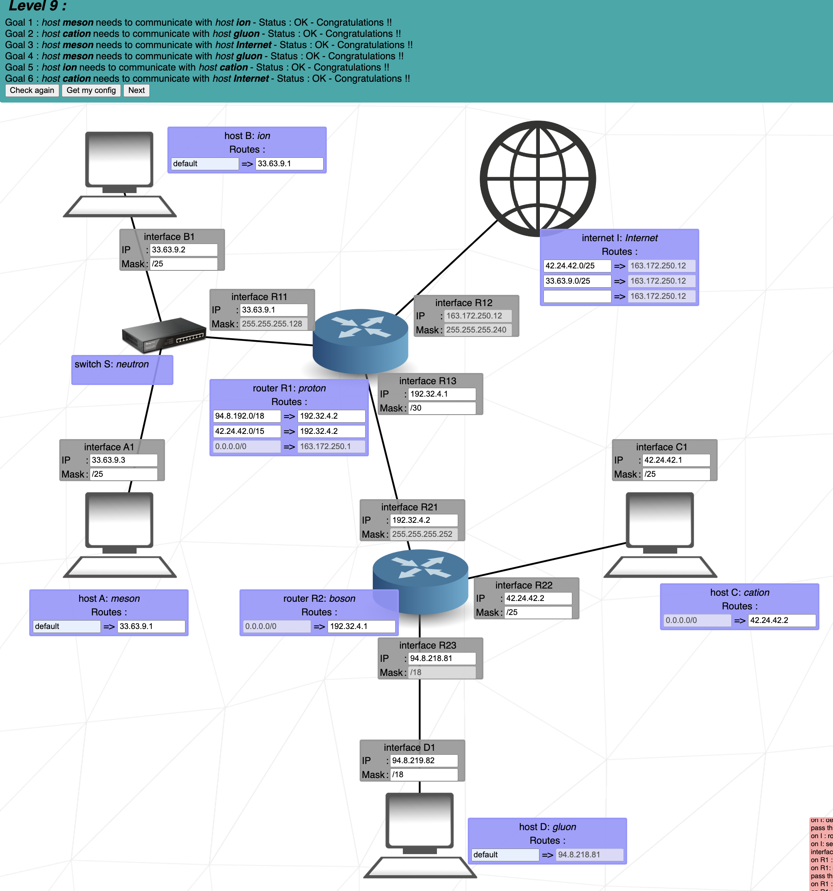

# Net_Practice

<p align="center">
  
</p>

Welcome to **Net_Practice**, an exercise aimed at mastering network setup and troubleshooting. This README will guide you through the essential concepts required to connect devices within a single network, split networks, and connect them to be successful in this project.

### How to Practice

Practice makes the master, so to practice this exercise, follow these steps:

1. **Clone the repository:**
   ```bash
   git clone git@github.com:Pablo-Palma/Net_Practice.git
   ```

2. **Enter the directory containing `index.html`:**
   ```bash
   cd Net_Practice/net_practice
   ```

3. **Launch the file with:**
   ```bash
   open index.html
   ```

This will open a web page in your browser with a series of interactive levels. You must enter your name or nickname and progress through the levels one by one until you reach the highest level.

If you already have some proficiency, you can leave the name field empty, and it will select `3` random levels from `6` to `10`, so you can test yourself.

I recommend starting by understanding the **Concepts** and how the **TCP/IP addressing** protocol works, and taking a look at the **Cheat Sheet** and the **Speed Tricks** I provide to take your skills to the next level.

<details>
<summary><strong>Concepts</strong></summary>

### 1. TCP/IP
**IP (Internet Protocol Addresses):** A unique string of numbers separated by dots (IPv4) or colons (IPv6) that identifies a device on a network. An IP address consists of two main parts: the **Network Id** and the **Host Id**, differentiated by a **Subnet Mask**. For example, in the IP address `192.168.1.1/24`, the Network Id is `192.168.1` and the Host Id is `1`.

#### Subcomponents:
- **Subnet Mask:** A combination of bits that masks the IP address and divides the network and host components.
- **Network Id:** The part of the IP address that identifies the specific network.
- **Host Id:** The part of the IP address that identifies the specific device on the network.

### 2. IPv4 vs IPv6

The transition from IPv4 to IPv6 has brought significant changes in internet protocol technology. Below is a comparative table highlighting the key differences between these two versions:

| Feature                   | IPv4                                   | IPv6                                        |
|---------------------------|----------------------------------------|---------------------------------------------|
| **Year of Deployment**    | 1981                                   | 1998                                        |
| **Bit Capacity**          | 32 bits                                | 128 bits                                    |
| **Number of Addresses**   | ~4.3 billion                           | ~340 undecillion (3.4 × 10^38)              |
| **Address Notation**      | Dotted decimal (e.g., 192.108.42.64)   | Colon-separated hexadecimal (e.g., 2002:0de6:0001:0042:0100:8c2e:0370:7234) |
| **Configuration**         | Manual configuration or DHCP           | Supports auto-configuration and more automatic options |
| **Address Use**           | Address reuse due to space limitation  | Each device can have its unique address      |

### 3. Devices

- **Switch:** Connects devices within the same network segment, reducing data traffic collisions and effectively managing data flow via MAC addresses (Media Control Access).
- **Router:** Links multiple networks or subnets, whether LAN (Local Area Network) or WAN (Wide Area Network). Ensures optimal traffic routing, assigns local IPs, and performs address translation through NAT (Network Address Translation). Key components in its routing table include:
  - **Next Hop:** Indicates the IP address of the next router where data packets will be sent.
  - **Destination:** Specifies the destination network for the data packets.

- **Modem:** A device that modulates and demodulates digital and analog signals, allowing a network to connect to the internet by translating data between these two types of signals.

### 4. Subnetting

Subnetting involves dividing a physical IP network into multiple logical subnets. Each subnet operates independently at the packet sending and receiving level, although all belong to the same physical network and domain.

### 5. Loopback Address

A special range of IP addresses (127.0.0.0 to 127.255.255.255) reserved for internal communications within a device. This allows a device to send and receive packets

 to and from itself, which is crucial for testing and network management.

</details>

<details>
<summary><strong>Mask Explanation</strong></summary>

### Introduction to Subnet Mask

**Initial Context:**
We assume the Network ID encompasses the first three octets, and we only interact with the last octet ranging from `192.168.1.0` to `192.168.1.255`.

**Details of the Last Octet:**
This last octet consists of 8 bits, each of which can be `0` or `1`. If all bits are activated (`11111111`), the result is `2^8 = 256`.

**IP Division:**
The IP address can be divided into **Network ID** and **Host ID** using the subnet mask. Assigning a CIDR mask of `/24`, we would be designating the first three octets (24 bits) for the **Network ID** and only the last octet for the host, covering a range from `192.168.1.0` to `192.168.1.255` with 256 possible IPs.

### Subdivision of the Network

**Applying a /25 Mask:**
We can subdivide this network into two equally sized networks using a `/25` mask, which leaves only the last 7 bits free for the host. This converts the original network into two networks:

- **First Network:** `192.168.1.0/25` which houses 128 IPs from `192.168.1.0` to `192.168.1.128`.
- **Second Network:** `192.168.1.128/25` which houses 128 IPs from `192.168.1.128` to `192.168.1.255`.

**Notation of the Subnet Mask:**
Alternatively, instead of using CIDR notation, we can use the direct subnet mask `/25`, which corresponds to `255.255.255.128`. This mask in binary is `11111111.11111111.11111111.10000000`, where the first bit `2^7 = 128` indicates that each network segment with this mask encompasses 128 possible IPs.

**Additional Note:**
Since the process may seem complex, a cheat sheet is included to facilitate the conversion from CIDR to Subnet Mask in 60 seconds.

</details>

<details>
<summary><strong>Cheat Sheet</strong></summary>

### Cheat Sheet

The way to interpret this **Conversion Table** is as follows: when we want to discover which network an IP belongs to, for example, `255.255.255.192/26`, we observe that it has a `CDIR` mask of `/26`, equivalent to a `Subnet Mask` of `192`, indicating that we are dividing the 4th octet into **Group Sizes** of 64 IPs.

From this, we deduce that there are 4 subnets: `256 / 64` = `4`.
With this table and a series of **steps** that I will explain in the following section: **How to Solve** you can resolve any subnetting issue in less than 60 seconds, but first, I will explain how to create this table from scratch.

| Group Size | 128 | 64 | 32 | 16 | 8 | 4 | 2 | 1 |
|------------|-----|----|----|----|---|---|---|---|
| Subnet Mask | 128 | 192| 224| 240| 248| 252| 254| 255 |
| CIDR        | /25 | /26| /27| /28| /29| /30| /31| /32 |

**Steps to Create the Table:**
1. **First row:** Represents the powers of 2, from `2^7` to `2^0`.
2. **Second row:** Is obtained by subtracting from 256 (the total number of IPs in an octet), the corresponding group size.
3. **CIDR Calculation:** Starting from the left, with `/25` taking the first bit of the fourth octet until covering all possible bits in four octets.

If you need to divide the third octet, you only need to add another row, starting from `/24` from right to left.

</details>

<details>
<summary><strong>How to solve</strong></summary>

# How to solve

First, let's address a series of concepts:
  # Concepts:

   - **Network id**: The part of the IP address that identifies the specific network.
   - **First id**: First usable IP, obtained by adding one to the **Network id**.
   - **Last id**: Last usable IP, obtained by subtracting one from the **Broadcast id**.
   - **Broadcast id**: Network address used to transmit to all devices connected

 to a multiple access communications network.


Now that you know how to create your own **Cheat Sheet**, and you understand the necessary concepts, there are no excuses, you can solve any **Subnetting** problem in less than 60 seconds by following these steps:

### **Steps**.

Suppose we want to find out which network the following **IP: 10.2.2.199/26** belongs to:

#### **Step 1: Analyze the Subnet Mask**

- **Subnet Mask:** `/26` which corresponds to `255.255.255.192`. This is derived from the binary pattern `11000000`, indicating:
  - `2^7 = 128`
  - `2^6 = 64`
  - Sum of bits: `128 + 64 = 192`
- With this configuration, we have 6 bits for the host, dividing the network into 4 subnets covering 64 IPs each.

#### **Step 2: Identify the Subnets and Position the Given IP**

- **Available Subnets:**
  1. `10.2.2.0` to `10.2.2.63`
  2. `10.2.2.64` to `10.2.2.127`
  3. `10.2.2.128` to `10.2.2.191`
  4. `10.2.2.192` to `10.2.2.255` (the subnet of interest)

- **Details of the Subnet of Interest:**
  - **Network ID:** `10.2.2.192`
  - **First ID:** `10.2.2.193`
  - **Last ID:** `10.2.2.253`
  - **Broadcast ID:** `10.2.2.254`
  - **Next ID:** `10.2.2.255`

- **Position of the IP `10.2.2.199/26`:** 
  - It is located within the fourth subnet (`10.2.2.192` to `10.2.2.254`).
  - **Availability of Addresses:** `64 - 2 = 62` addresses, from the `First ID` to the `Last ID`.

If a CIDR `/29` were used, the process would involve counting from 8 to 8 starting from `10.2.2.0` to `10.2.2.192`, which could result in a really slow and boring process. Therefore, I will present you with some **Speed Tricks** in the following section that will take your efficiency to the next level.

# Speed Tricks:

To simplify the process when searching for which subnet an IP belongs to, especially when the GROUP SIZE is small, you can use these tricks:

**1. Multiply the GROUP SIZE by 10:**
   - Example: 8 * 10 = 80; Results: .8, .80, .160

**2. Multiply the GROUP SIZE by 2:**
   - Results: .8 -> .80 -> .160 (multiply .80 by 2)

**3. All groups pass through 128**, so we can start from this number to initiate the search.

**4. All groups pass through the subnet mask to their left in the cheat sheet**, therefore, it is a good time to make use of this, and if we pass it, start with a higher IP and subtract the GROUP SIZE until finding the segment to which our target IP belongs.

</details>

<details>
<summary><strong>Levels</strong></summary>

- <details>
  <summary><strong>Level 6</strong></summary>

     ## Level 6: Network Configuration with Router
  
    ### Network Structure
    Level 6 involves two networks connected by a router:
    - **First network:** Directly connected to `internet`.
    - **Second network:** Connected through a switch, ending at `Host A`.
    
    ### Configuration of the Second Network
    For the second network, the following configurations are applied:
    - **Subnet Mask:** `255.255.255.128` (`/25`)
    - **IP Address of Host A:** `110.98.32.227`
    
    ### Division of the Network
    The network `110.98.32.0/24` is divided into two groups of 128 IP addresses each. We will use the second group, which includes:
    - **Network ID:** `110.98.32.128`
    - **Broadcast ID:** `110.98.32.255`
    
    The valid addresses for the router interface are between `110.98.32.129` and `110.98.32.254`, excluding the Network and Broadcast IDs.
    
    ### Key Objective
    It
  
   is crucial to ensure that the destination of internet traffic is configured to point to the network `110.98.32.128/25` to facilitate proper traffic flow.
  
  
    
    

  </details>

- <details>
  <summary><strong>Level 7</strong></summary>

  ### Scenario Description
  This level involves setting up a connection between two routers, each connecting a host. It is required to divide the network `105.198.14.0/24`.

  ### Division of the Network
  For efficient organization, the network is divided into `4` subnets of `64` IPs each, using a `/26` subnet mask:
  - **First Subnet:** Used to connect `A1` and `R1` (Addresses between .0 and .64).
  - **Last Subnet:** (Addresses between .192 and .255) Used to connect the two routers.
  - **Second or Third Subnet:** For connecting `R2` and `C1`. (Addresses between .64 and .192).
 
  It is essential to avoid `overlapping`.

  ### Routing Table Configuration
  - **Destinations:** Destinations can be set to default values.
  - **Next Hop:** It is crucial that the `Next Hop` in the routers is configured to point to each other, allowing efficient traffic exchange. The hosts should point to the next router.

  

  </details>

- <details>
  <summary><strong>Level 8</strong></summary>

    ### Scenario Description
  In level 8, two routers form the core of the configuration:
  - **R1:** Directly connected to the internet.
  - **R2:** Connects two networks which in turn connect the hosts `D` and `C`.

  ### Connection Configuration between Routers
  A `/30` network mask is preferred for the connection between routers, providing 4 IPs:
  - **Network ID:** Excluded.
  - **Broadcast ID:** Excluded.
  - **Available IPs:** Two, used for the interfaces of `R1` and `R2` respectively.
  
  The **Next Hop** of `R2` uses the IP of the interface `R13`, and the interface `R21` can use a lower IP within the same range.

  ### Subnetting and Internet Connection
  Subnetting is performed on the network `158.46.67.0/26` with a `/28` mask, which provides 16 IPs per subnet:
  - **For Host D:** Use any of the first 16 IPs (excluding Network and Broadcast IDs).
  - **For Host C:** Occupies the range from `.17` to `.30` under the same `/28` mask, ensuring no overlap with the range used for the routers.

  ### Routes and Routing
  - **Network of Hosts' Destination:** `158.46.67.0/26`.
  - **Next Hop of Internet:** Must be configured on the interface of the next router.

  

  </details>

- <details>
  <summary><strong>Level 9</strong></summary>

  
    ### General Description
    This level presents the task of connecting three networks to the internet, with specific approaches for Hosts A and B, and for Hosts C and D, coordinated through two routers, R1 and R2.
  
    ### Step 1: Connection of Hosts C and D
    - **IP of the R23 interface:** `94.8.218.81` with a `/18` mask.
    - **Network D Range:** 
      - **Network ID:** `94.8.192.0/18`
      - **Broadcast ID:** `94.8.255.255/18`
    - **Network C Range:** 
      - You can set any valid IP of your choice for **Host C**. To simplify, the network `42.24.42.0/25` will be used, dividing it into two subnets of 128 IPs each, and the first will be used for **Host C**, giving you free choice among the values of:
        - **Network ID:** `42.24.42.0/25`
        - **Broadcast ID:** `42.24.42.128/25`  
  
    ### Step 2: Connection of the Two Routers
    - **CDIR `/30` Mask Configuration for R1 and R2:** This setup provides 4 IPs, two of which are useful.
    - **Example Network:** `192.32.4.0/30`.
    - It is essential that each Router points its **Next Hop** to the other router. Additionally, the destination in the first router must include both the network of `Host C`
  
   for access to `internet` and that of `Host D` for the connection with `Host A`.
  
    ### Step 3: Connection of Hosts A and B
    - Three devices are connected in the same network `33.63.9.0/25`.
    - It is important that the **Next Hop** in both Hosts A and B point to the interface of R11.
  
    ### Step 4: Configuration of the Internet Routing Table
    - **Next Hop:** Configured to point to the interface of the router.
    - **Destinations:** Must be set to include the networks of Host C `42.24.42.0/25` and the network connecting A and B `33.63.9.0/25`, which are essential for the connection to the internet.
  
    
    
  </details>

- <details>
  <summary><strong>Level 10</strong></summary>

  ### General Description
  Final level! It's not as complicated as it seems. We have a setup where the router **R1** connects the internet with the first two hosts via a switch, and also connects to another router, **R2**, which in turn connects two networks ending in **Host 3** and **Host 4**.

  The key here is that hosts 1, 3, and 4 must connect to the internet, but the internet routing table only recognizes one `destination` for the entire range `140.45.158.0/24`.

  ### Step 1: Connection of the First Two Hosts
  - A `/25` mask is assigned, allowing IPs in the last octet from `.0` to `.128`.

  ### Step 2: Connection between Routers R1 and R2
  - A `/30` mask (`255.255.255.252`) is set, which leaves us with 4 IPs, two of which are effectively useful after excluding the **Network ID** and the **Broadcast ID**.

  ### Step 3: Connection of the Last Two Hosts
  - Hosts 3 and 4 connect to **R2** under a `255.255.255.192` (`/26`) mask, occupying from `.128` to `.192`.
  - To avoid overlaps with the network `140.45.158.252/30` used between R1 and R2, a `/27` mask is applied for Host 4, covering 32 IPs, using the range `140.45.158.192` to `140.45.158.224`.

  

  If you've made it this far, I assume you're either the kind of person who starts a book from the last page or you found this guide useful.
  
  Congratulations! You're one step away from becoming a `master` of `Networking` and that step is practice.
  If you found this guide helpful, don't hesitate to star the repo for later consultation and share it with your friends so they can also become `Masters!`.

  Feel free to contact me if you have any questions or would like to contribute improvements, greetings.

  Pablo Palma.
  </details>
